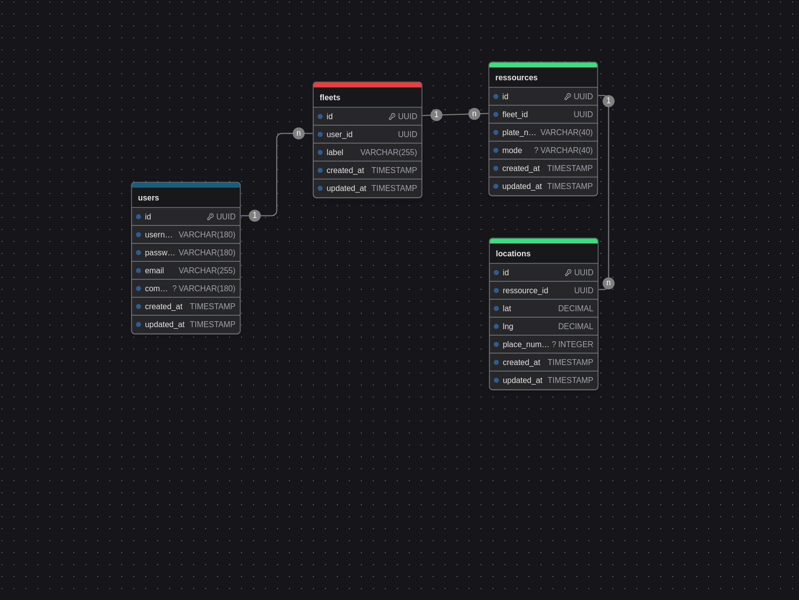

# Backend Fulll hiring test

## Introduction

Ce projet est un test technique proposé par Fulll pour un poste de **Backend Engineer**.
L'objectif est de gérer une flotte de véhicules.

Ayant travaillé dans le domaine de la supply chain ces dernières années, j'avais certaines attentes pour ce projet.

Bien que la consigne précise de ne pas utiliser de framework, j'ai choisi de réaliser un projet complet en **Symfony 7.1**.
Cette décision a été motivée par la volonté de produire un travail aussi abouti que possible dans un temps raisonnable.
Par ailleurs, compte tenu de l'évolution de notre métier, l'utilisation de PHP "vanilla" n'a plus réellement de sens.
Les frameworks modernes, comme Symfony, sont aujourd'hui suffisamment matures pour être utilisés de manière sécurisée.

J'ai choisi d'utiliser une **architecture hexagonale** plutôt que simplement le **DDD** (Domain-Driven Design), 
car j'apprécie particulièrement l'idée de séparer clairement les interfaces, comme les CLI, des autres couches de l'application.

### Pourquoi l’architecture hexagonale ?

L'architecture hexagonale est souvent plus adaptée pour des projets où la flexibilité et l'indépendance vis-à-vis des outils 
techniques sont essentielles, notamment pour des POCs ou des projets nécessitant une forte modularité.

## La stack technique

L'utilisation de **Docker** m'est apparue comme la meilleure solution pour fournir un travail abouti tout en permettant à 
une équipe de développement d'être rapidement opérationnelle.

Les technologies utilisées sont très classiques :

- **PHP 8.2**
- **PostgreSQL 16**
- **Nginx**

Note : Pour renforcer la sécurité et éviter d'éventuelles incompatibilités lors de futurs builds, 
j'aurais pu spécifier plus précisément les versions des dépendances.

## Framework 

J'ai choisi d'utiliser la version stable de **Symfony 7.1** afin de faciliter une évolution (potentielle) du projet à l'avenir.
L'utilisation de **Messenger** pour l'enregistrement des informations permet une répartition efficace des charges.
Bien que j'aurais également pu opter pour une approche basée sur l'**event sourcing**, cette solution m'a semblé moins pertinente pour un POC (Proof of Concept).

> Un système de messaging est un excellent compromis pour un POC, car il offre une architecture légère et flexible tout en posant les bases d’une éventuelle transition vers des paradigmes plus complexes, comme l’event sourcing, si le projet évolue.

## BDD

Le schéma de base reprend les entités suivantes :
- **Fleets** : Les flottes de véhicules.
- **Resources** : Les véhicules, quel que soit leur type.
- **Locations** : Les positions géographiques des véhicules.

Dans un souci de simplicité, j'ai choisi de gérer une table unique Users, 
sans utiliser les outils de gestion d'utilisateurs fournis par **Symfony**.



## Outils Clean Code

Pour garantir une bonne maintenance du code, les bibliothèques suivantes ont été utilisées :
- **PHPStan** : Un analyseur statique qui permet de détecter les erreurs potentielles, les types incorrects, et les incohérences dans le code avant même son exécution. Il contribue à améliorer la qualité et la fiabilité du code.
- **PHP CS Fixer** : Un outil de formatage qui applique automatiquement les standards de codage (PSR-12, entre autres). Cela garantit un code propre, lisible et cohérent au sein de l'équipe.

Dans l'optique de faire évoluer le projet, nous pourrions intégrer DepTrac.
> Cette bibliothèque permet de visualiser et de vérifier les dépendances entre les différentes couches et modules d'une application. 
> Elle aide à respecter les principes d'architecture (comme l'architecture hexagonale ...) et à prévenir les dépendances non souhaitées. Cela garantit une structure de code plus robuste et maintenable sur le long terme. 

J'aurais aimé utiliser Rector, mais il semble qu'il y ait une incompatibilité avec **PHPStan 2.X**.

> Rector est un outil puissant de refactorisation automatique pour PHP. 
> Il permet de moderniser et d'améliorer le code en appliquant des règles de transformation prédéfinies. 
> Rector peut être utilisé pour migrer vers des versions plus récentes de PHP, appliquer des patterns de code modernes ou encore refactorer le code pour le rendre plus propre et plus maintenable.

## CI GitHub

Une simple CI en **GitHub Actions**, basée sur notre **Makefile**, a été mise en place. 
L'utilisation de nos fonctions Make nous permet de capitaliser sur les actions déjà définies dans le **Makefile** pour la mise en place de l'environnement.
Nous pouvons donc profiter de la vérification avec **PHPStan** et **PHP CS Fixer**.
Les tests **PHPUnit** et **Behat** sont aussi lancés automatiquement.

## Get Started

Pour commencer, il suffit de lancer les commandes suivantes : 

```shell
make build-initial
```
```shell
make database-init
```

Cela lancera la construction des containers et l'initialisation de la base de données avec les fixtures associées.

Pour lancer les containers sans effectuer de build, utilisez la commande suivante :

```shell
make start
```